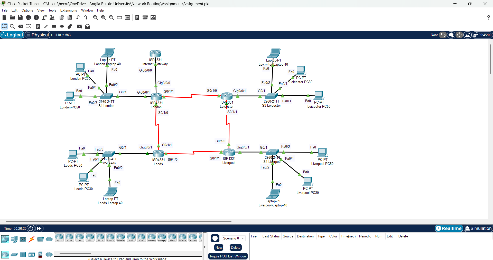
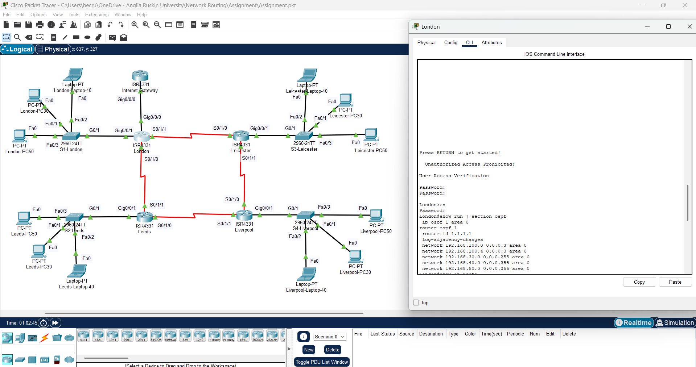
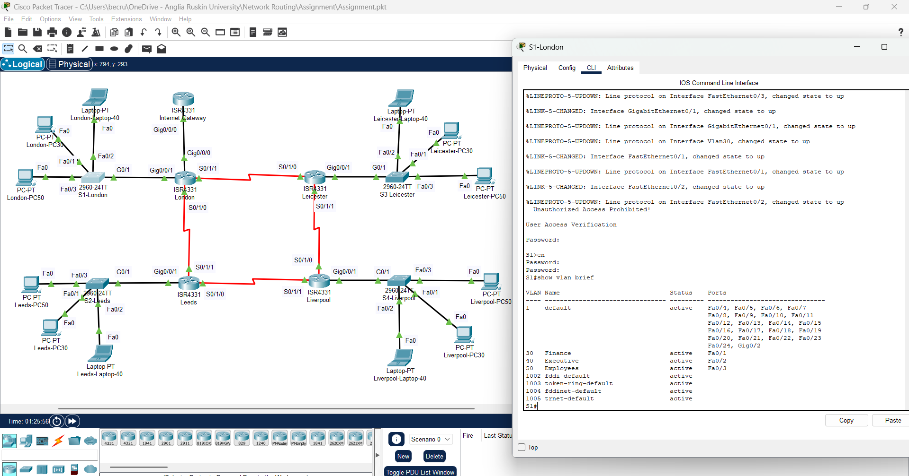
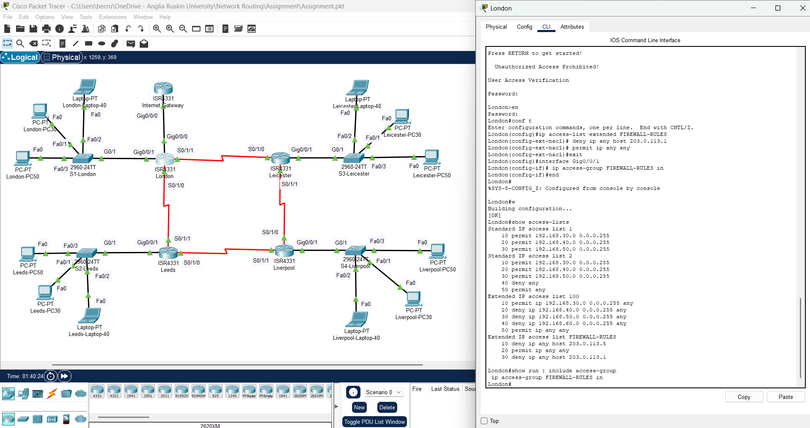
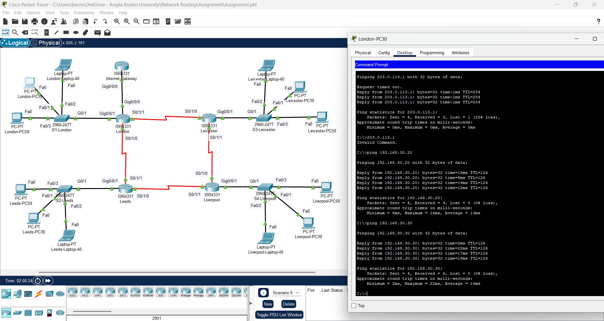
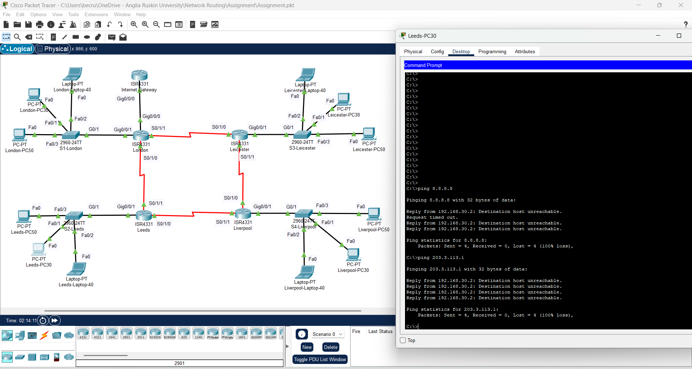

 Network Routing Project – FinTec Inc.

## Project Overview

This project was completed as part of the MOD003262 Network Routing module at Anglia Ruskin University. The project focused on designing, configuring and validating a secure multi-site enterprise network for FinTec Inc. using Cisco Packet Tracer.

The network design connected four branch locations: London, Leeds, Liverpool and Leicester. The solution included VLAN segmentation, Router-on-a-Stick inter-VLAN routing, OSPF dynamic routing, DHCP configuration, Access Control Lists (ACLs), SSH hardening and connectivity/security testing.

## Aim

The aim of this project was to design a scalable, secure and efficient network infrastructure that supports inter-site communication while enforcing segmentation and controlled internet access.

## Technologies Used

- Cisco Packet Tracer
- Cisco ISR4331 Routers
- Cisco 2960 Layer 2 Switches
- VLANs
- Router-on-a-Stick (ROAS)
- OSPF Routing
- Static Routing
- DHCP
- ACLs
- SSH
- VLSM / IP Addressing
- Ping and connectivity testing

## Key Features

- Multi-site enterprise network topology
- Four branch locations: London, Leeds, Liverpool and Leicester
- VLAN segmentation for Finance, Executive and Employees
- OSPF routing between branch routers
- Router-on-a-Stick configuration for inter-VLAN routing
- DHCP-based IP address allocation
- ACL firewall rules to restrict unauthorised access
- SSH-only remote management for device hardening
- Connectivity and security validation using ping and CLI testing

## Implementation Evidence

### Network Topology

The topology shows the multi-site network design connecting London, Leeds, Liverpool and Leicester using Cisco routers, Layer 2 switches and end devices.

---

### OSPF Configuration

OSPF was configured as the main dynamic routing protocol to support communication between the four branch sites and allow routes to be advertised automatically.

---

### VLAN Configuration

VLANs were implemented to separate departments such as Finance, Executive and Employees. This improves network organisation, segmentation and security.

---

### ACL and Firewall Rules

Access Control Lists were configured to control traffic flow and restrict unauthorised access, including limiting internet access to approved London branch devices.

---

### Connectivity Testing

Ping testing was used to verify communication between devices across different branches and confirm that routing and VLAN connectivity were working correctly.

---

### Internet Access Restriction Testing

Security testing confirmed that non-authorised branch devices were blocked from accessing external networks, while permitted London devices were able to reach the internet.

---

## Testing and Validation

Testing included:

- VLAN connectivity testing
- Inter-branch ping testing
- OSPF neighbour verification
- Routing table checks
- ACL functionality testing
- Internet access restriction testing
- SSH-only access validation

## Skills Demonstrated

- Network design
- Cisco Packet Tracer simulation
- VLAN configuration
- OSPF routing
- Static routing
- DHCP implementation
- Access Control Lists
- Router and switch configuration
- Network troubleshooting
- Security testing
- Technical documentation

## What I Learned

This project helped me develop practical networking skills by designing and testing a realistic enterprise-style network. I gained experience in configuring routing, VLANs, DHCP, ACLs and secure remote access. I also improved my troubleshooting skills through connectivity testing and validation across multiple network locations.

## Project Status

Completed as part of BEng (Hons) Computer Science studies at Anglia Ruskin University.
